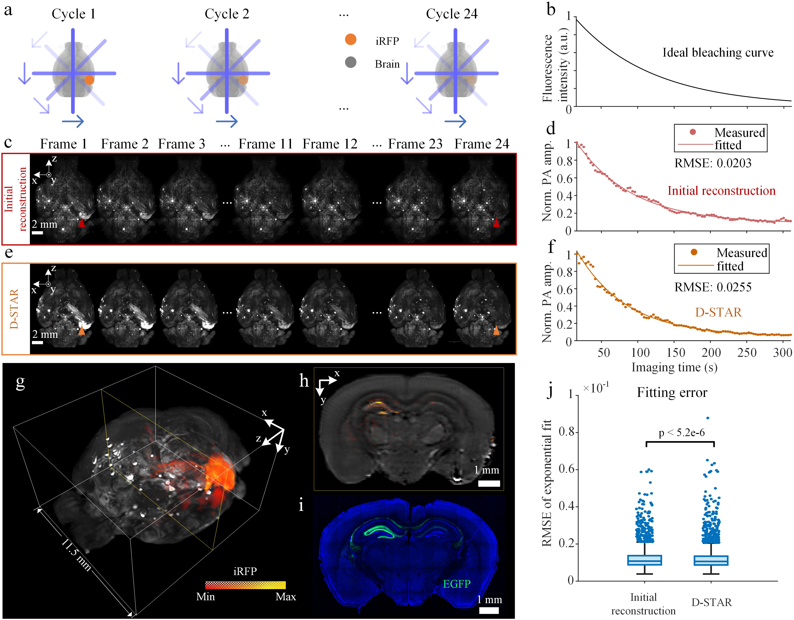

# D-STAR: Diffusion-based Sparse Tomographic Angular Recovery for Isotropic-Resolution Photoacoustic Imaging

**Di Kong<sup>1,2</sup>, Haoyu Yang<sup>1</sup>, Yan Luo<sup>1</sup>, Zhiqiang Chen<sup>3</sup>, Bo Lei<sup>3</sup>, Yi Zhong<sup>1</sup>, Mingyuan Liu<sup>4</sup>, Yuwen Chen<sup>1</sup>, Cheng Ma<sup>1,2</sup>**

<sup>1</sup> Tsinghua University  <sup>2</sup> Zhongguancun Academy <sup>3</sup> BAAI <sup>4</sup> Capital Medical University

This is the official PyTorch implementation of **D-STAR**.

[](https://ieeexplore.ieee.org/abstract/document/11018487)

## Abstract

Anisotropy in imaging systems often results in directional degradation, impairing image quality and complicating subsequent analyses. While multiangle imaging has proven effective in mitigating these effects, it introduces challenges such as extended imaging times and increased excitation doses. 

To address these limitations in Photoacoustic Tomography (PAT), we propose a novel approach—Diffusion-based Sparse Tomographic Angular Recovery (D-STAR). D-STAR significantly reduces the number of required angles for high-resolution PAT while maintaining image quality comparable to full tomographic angular imaging. By training a diffusion model on a custom 3D PAT dataset, we optimize the balance between spatial and temporal resolutions, signal-to-noise ratio (SNR), and laser exposure.

Our experiments with excised brain and vessel phantoms demonstrate that D-STAR produces high-fidelity images suitable for both structural and molecular imaging. This method outperforms existing approaches in static structural recovery and quantitative data extraction, offering substantial improvements in imaging quality, particularly in resolution and contrast. Furthermore, D-STAR enhances flexibility in imaging system design, reducing the need for hardware upgrades while improving temporal resolution and minimizing laser exposure.

<p align="center">

</p>


## Getting Started


### Cloning the repository

```bash
git clone git@github.com:thu-bplab/D-STAR.git
cd D-STAR
```

### Setting up the environment

```bash
conda create --name dstar -y python=3.10
conda activate dstar
pip install -r requirements.txt
```

### 🧱 Dataset Downloads
Download the D-STAR dataset from [TsinghuaCloud](https://cloud.tsinghua.edu.cn/d/2d9a3ddc78084c3fbb04/).


## Running the Inference

Coming soon...

## Training the Model

Coming soon...

## Acknowledgements

We thank the authors of [Med-DDPM](https://github.com/mobaidoctor/med-ddpm), [Guided-Diffusion](https://github.com/openai/guided-diffusion), [denoising-diffusion-pytorch](https://github.com/lucidrains/denoising-diffusion-pytorch) for their outstanding codebase, which served as a foundation for this project.

## Citation

If you find our work useful for your project, please consider citing the following paper.

```bibtex
@article{kong2025d,
  title={D-STAR: Diffusion-based Sparse Tomographic Angular Recovery for Isotropic-Resolution Photoacoustic Imaging},
  author={Kong, Di and Yang, Haoyu and Luo, Yan and Chen, Zhiqiang and Lei, Bo and Zhong, Yi and Liu, Mingyuan and Chen, Yuwen and Ma, Cheng},
  journal={IEEE Transactions on Medical Imaging},
  year={2025},
  publisher={IEEE}
}
```
